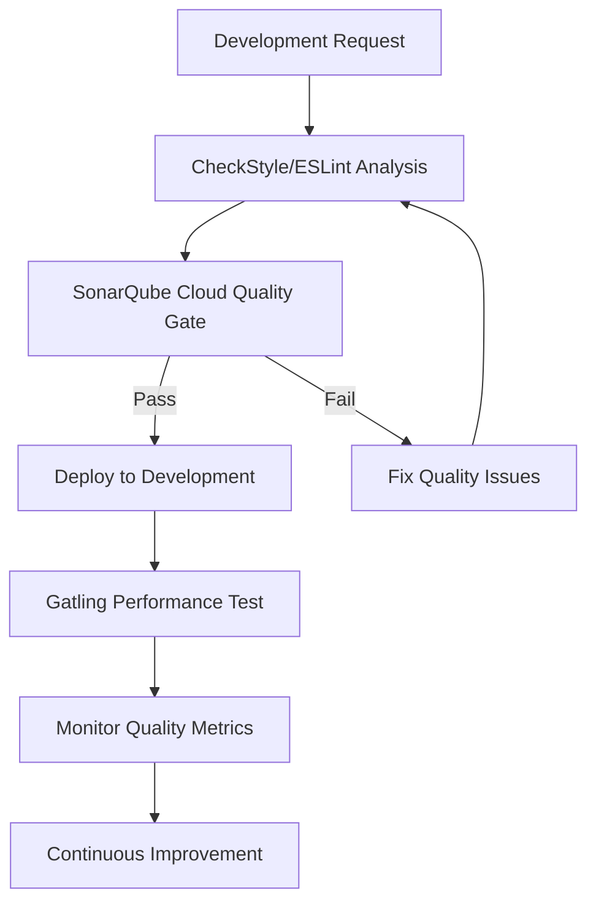
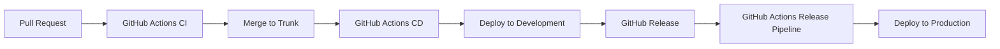
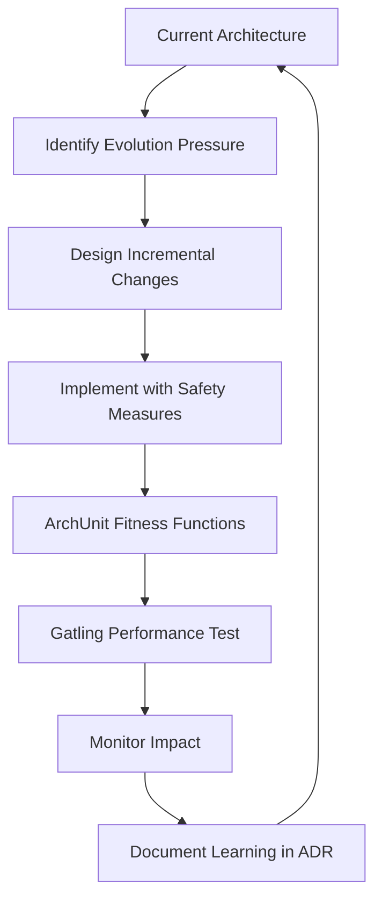
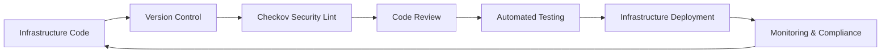
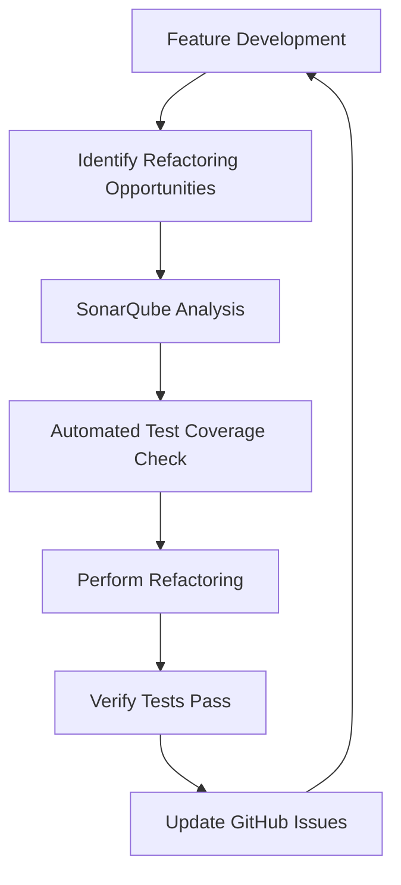

<!--
Sync Impact Report:
- Version change: N/A → v1.0.0 (initial constitution)
- Modified principles: N/A (adapted from Agora SpecKit v2.2.0)
- Added sections: All (initial creation based on Agora SpecKit template)
- Removed sections: None
- Templates requiring updates: N/A (no templates exist yet)
- Follow-up TODOs: None
-->

# Task List Engineering Constitution

**Version**: 1.0.0
**Ratification Date**: 2025-12-24
**Last Amended Date**: 2025-12-24

This constitution defines the fundamental engineering principles, practices, and governance
framework for the Task List project. It establishes non-negotiable standards that guide all
technical decisions and development activities.

## Engineering Principles

### 1. Quality First

Quality is paramount in all engineering decisions and MUST take precedence over speed or
feature scope. Every deliverable MUST meet defined quality standards before release.

**Non-negotiable rules:**
- Code coverage MUST be minimum 80% for all business logic
- SonarQube Cloud MUST be used as the quality gate with zero blocker/critical issues
- All code MUST pass static analysis (CheckStyle for Java, ESLint for TypeScript) in SARIF format
- Security vulnerabilities rated high or critical MUST be resolved before deployment
- Performance requirements (API response times <200ms p95) MUST be met using Gatling
- Accessibility compliance (WCAG 2.1 AA) MUST be verified

**Rationale**: Technical debt compounds exponentially. Establishing quality gates with
standardized tooling prevents long-term maintenance costs and ensures reliable software.

### 2. DevOps

Development and Operations MUST be integrated through automation, collaboration, and shared
responsibility for the entire application lifecycle using GitHub Actions.

**Non-negotiable rules:**
- All deployments MUST be automated through GitHub Actions CI/CD pipelines
- Infrastructure changes MUST be version-controlled and reviewed with Checkov linting
- Three distinct pipelines MUST exist: CI (PR), CD (trunk merges), Release (production)
- CD pipeline MUST automatically deploy trunk commits to development environment
- Rollback procedures MUST be automated and tested regularly
- Cross-functional teams MUST include both development and operations perspectives

**Rationale**: Reliable, fast deployments enable rapid response to changing requirements.
DevOps practices with standardized GitHub Actions ensure system stability while enabling
continuous small deployments.

### 3. Site Reliability Engineering (SRE)

System reliability MUST be engineered through service level objectives, error budgets, and
proactive monitoring to ensure consistent availability.

**Non-negotiable rules:**
- Service Level Objectives (SLOs) MUST be defined for all critical services (99.9% uptime)
- Error budgets MUST be tracked and enforced to balance feature velocity with reliability
- Incident response procedures MUST be documented and tested quarterly
- Monitoring and alerting MUST provide actionable insights with <5 minute detection time
- Post-incident reviews MUST identify root causes and implement preventive measures
- Two environments MUST be maintained: development (acting as stage) and production

**Rationale**: Users depend on system availability for their task management needs. SRE
practices ensure predictable, measurable reliability with simplified environment management.

### 4. Evolutionary Architecture

System architecture MUST evolve incrementally through guided change, supporting both current
needs and future adaptability without major rewrites. Architectural characteristics MUST be
enforced through automated fitness functions.

**Non-negotiable rules:**
- Architectural decisions MUST be documented using Architecture Decision Records (ADRs)
- System design MUST support incremental modification through loose coupling
- Breaking changes MUST be avoided; when unavoidable, migration paths MUST be provided
- Performance and scalability MUST be monitored with Gatling and architecture adjusted accordingly
- Technology choices MUST be evaluated for long-term sustainability and ecosystem health
- Architectural constraints MUST be enforced through automated fitness functions (ArchUnit for
  Java, custom tests for other languages)
- Layer dependencies, package structure, and naming conventions MUST be validated in CI pipelines
- Architectural fitness function tests MUST fail the build when violations are detected

**Rationale**: Software requirements evolve rapidly. Evolutionary architecture enables
adaptation without compromising existing functionality or requiring costly rewrites. Automated
fitness functions prevent architectural drift and ensure design decisions remain enforceable
over time.

### 5. Clean Code

Code MUST be written for human readability and maintainability, following established
principles that make software easy to understand, modify, and extend.

**Non-negotiable rules:**
- Functions MUST have single responsibility and be under 20 lines when possible
- Variable and function names MUST clearly express intent without requiring comments
- Code duplication MUST be eliminated through appropriate abstraction
- Dependencies MUST be minimized and explicitly managed
- Java code MUST use CheckStyle enforcing Google Java Format with SARIF output
- TypeScript code MUST be linted by ESLint and formatted by Prettier with SARIF output
- Code formatting MUST be consistent and automated in CI/CD pipelines

**Rationale**: Clean code with enforced formatting standards ensures knowledge transfer and
reduces maintenance burden across teams and over time.

### 6. Infrastructure as Code

All infrastructure MUST be defined, versioned, and managed through code, enabling
reproducible, auditable, and scalable deployments.

**Non-negotiable rules:**
- Infrastructure definitions MUST be stored in version control alongside application code
- Environment configurations MUST be declarative and idempotent
- Infrastructure changes MUST go through the same review process as application code
- Secrets and sensitive configuration MUST be managed through secure, auditable systems
- Infrastructure provisioning MUST be automated and reproducible across environments
- Docker images, pipelines, and infrastructure MUST be linted by Checkov with SARIF output

**Rationale**: Transparent, auditable infrastructure management with security linting provides
accountability and reduces manual errors that could compromise security or availability.

### 7. Continuous Delivery

Software MUST be maintained in a deployable state at all times, enabling rapid, safe delivery
of features and fixes to production.

**Non-negotiable rules:**
- Trunk branch MUST always be in a deployable state
- Deployments MUST be automated, tested, and reversible through GitHub Actions
- Feature toggles MUST be used to decouple deployment from feature release
- Deployment pipelines MUST include automated security and compliance checks
- Release cadence MUST support business needs without compromising quality
- Continuous small deployments MUST be expected and supported
- Versions MUST follow semantic versioning standards

**Rationale**: Continuous delivery with semantic versioning enables fast, reliable software
updates while maintaining system stability and predictability.

### 8. Continuous Refactoring

Code quality MUST be continuously improved through systematic refactoring, preventing
technical debt accumulation and maintaining system adaptability.

**Non-negotiable rules:**
- Refactoring MUST be performed as part of regular development cycles, not as separate projects
- Code metrics MUST be monitored through SonarQube Cloud and declining trends addressed immediately
- Automated tests MUST provide safety net for refactoring activities
- Refactoring decisions MUST be justified by measurable improvements in maintainability or
  performance
- Legacy code MUST be systematically modernized during feature development
- Technical debt MUST be tracked in GitHub Issues and addressed in each sprint

**Rationale**: Continuous refactoring prevents code degradation and ensures the system remains
adaptable to evolving needs without major rewrites.

## Technical Standards

### Quality Assurance Toolchain

**Code Quality:**
- SonarQube Cloud as central quality gate and scanner
- CheckStyle for Java with Google Java Format enforcement
- ESLint and Prettier for TypeScript/JavaScript
- All tools MUST generate SARIF format reports for SonarQube Cloud consumption

**Architectural Fitness Testing:**
- ArchUnit for Java architectural constraint validation
- Fitness functions MUST validate layer dependencies (e.g., domain cannot depend on
  infrastructure)
- Fitness functions MUST enforce package naming conventions and structure
- Fitness functions MUST prevent circular dependencies
- Custom fitness function tests for non-Java languages (e.g., eslint-plugin-import for
  TypeScript)
- Architectural tests MUST run as part of the CI pipeline and fail on violations

**Security & Compliance:**
- Snyk for dependency vulnerability scanning in CD pipeline
- Checkov for infrastructure, pipeline, and Docker image security linting
- Security scans MUST be performed on every deployment

**Performance & Load Testing:**
- Gatling for performance testing and benchmarking
- Performance tests MUST be included in release pipelines
- Performance regression MUST block production deployments

### CI/CD Pipeline Architecture

**Continuous Integration (GitHub Actions):**
- Triggered on pull request creation and updates
- Runs unit tests, linting, security scans, architectural fitness functions, and quality checks
- Architectural fitness tests (ArchUnit) MUST pass before merge is allowed
- Must pass before merge is allowed

**Continuous Deployment (GitHub Actions):**
- Triggered on trunk branch merges
- Deploys automatically to development environment
- Includes full test suite and performance validation

**Release Pipeline (GitHub Actions):**
- Triggered on GitHub release creation
- Deploys to production environment
- Includes comprehensive testing and rollback capabilities

### Project Management

**Task Tracking:**
- GitHub Issues and GitHub Projects MUST be used for all task management
- Issues MUST be properly labeled and categorized
- Sprint planning MUST utilize GitHub Projects features

**Version Management:**
- Semantic versioning (semver) MUST be followed strictly
- All releases MUST be tagged and documented
- Breaking changes MUST be clearly communicated

### Environment Strategy

**Development Environment:**
- Acts as staging environment for continuous deployment
- Mirrors production configuration and data structure
- Used for integration testing and user acceptance testing

**Production Environment:**
- Deployed only through release pipeline
- Monitored continuously with SRE practices
- Maintains high availability and performance standards

## Governance

### Amendment Process

1. **Proposal**: Submit changes via pull request with detailed rationale
2. **Review**: Technical leads review for alignment with project goals
3. **Discussion**: Open discussion period for team feedback (minimum 3 days)
4. **Approval**: Requires approval from at least 2 technical leads
5. **Documentation**: Update version number and amendment date

### Version Management

- **MAJOR**: Fundamental principle changes or removals (backward incompatible)
- **MINOR**: New principles added or existing principles significantly expanded
- **PATCH**: Clarifications, corrections, or non-semantic improvements

### Compliance Review

- Monthly review of adherence to constitutional principles using SonarQube Cloud metrics
- Quarterly assessment of principle effectiveness and tool performance
- Annual comprehensive review with potential constitutional updates
- Violations addressed through education, process improvement, or tooling enhancements

### Enforcement

Teams MUST demonstrate compliance through:
- Automated quality gates in GitHub Actions CI/CD pipelines
- Regular architecture reviews aligned with constitutional principles
- SonarQube Cloud quality metrics meeting defined thresholds
- Incident post-mortems that reference relevant constitutional violations
- Performance metrics tracked through Gatling and monitoring systems

### Tool Integration Requirements

All specified tools MUST be integrated and configured to support constitutional principles:
- SonarQube Cloud MUST receive SARIF reports from all linting and security tools
- GitHub Actions MUST enforce quality gates at appropriate pipeline stages
- Snyk vulnerability scanning MUST be automated and monitored
- Checkov security linting MUST be applied to all infrastructure artifacts
- Gatling performance testing MUST be integrated into release processes
- ArchUnit architectural tests MUST be executed in CI pipeline and block merges on violations
- Fitness function test results MUST be tracked and reported alongside other quality metrics

This constitution serves as the foundation for all engineering decisions within the Task List
project. All team members are expected to understand, follow, and advocate for these
principles in their daily work.
