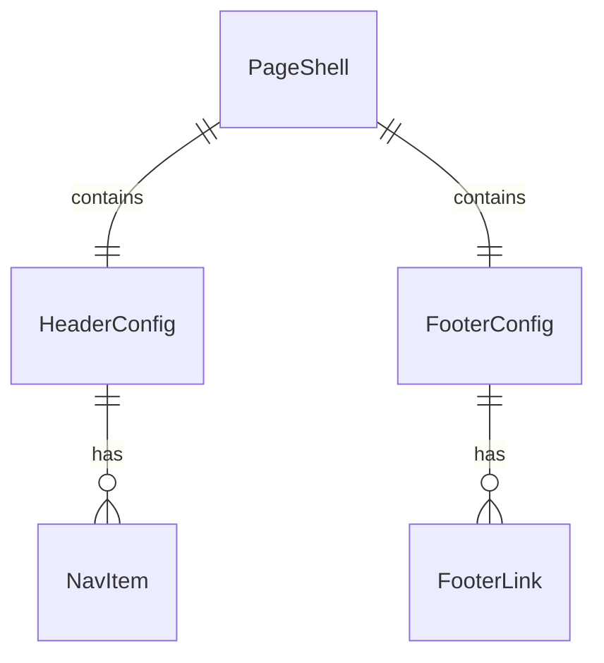

# Data Model: Frontend Scaffolding

**Date**: 2025-12-25
**Feature**: 002-frontend-scaffolding

## Overview

The frontend scaffolding has minimal data model requirements as it focuses on project
structure and tooling rather than business domain entities. The entities defined here
represent configuration and UI state rather than persisted data.

## Entities

### PageShell

Represents the base application structure displayed on initial load.

| Field | Type | Description |
|-------|------|-------------|
| title | string | Page title displayed in browser tab |
| description | string | Meta description for SEO |
| header | HeaderConfig | Header component configuration |
| footer | FooterConfig | Footer component configuration |

**Validation Rules**:
- `title` MUST be non-empty, max 60 characters
- `description` MUST be non-empty, max 160 characters

### HeaderConfig

Configuration for the application header component.

| Field | Type | Description |
|-------|------|-------------|
| logoAlt | string | Alt text for logo (accessibility) |
| navItems | NavItem[] | Navigation menu items (empty for scaffolding) |

### FooterConfig

Configuration for the application footer component.

| Field | Type | Description |
|-------|------|-------------|
| copyrightText | string | Copyright notice text |
| links | FooterLink[] | Footer links (empty for scaffolding) |

### WebVitalsMetric

Core Web Vitals measurement captured for observability.

| Field | Type | Description |
|-------|------|-------------|
| name | 'LCP' \| 'FID' \| 'CLS' \| 'FCP' \| 'TTFB' | Metric identifier |
| value | number | Metric value |
| rating | 'good' \| 'needs-improvement' \| 'poor' | Performance rating |
| navigationType | string | Navigation type (navigate, reload, etc.) |

## State Transitions

Not applicable for scaffolding - no stateful entities with lifecycle.

## Relationships

## Notes

- These entities are UI configuration, not persisted data
- Future features will add domain entities (Task, User, etc.)
- WebVitalsMetric is emitted to observability backend, not stored locally
