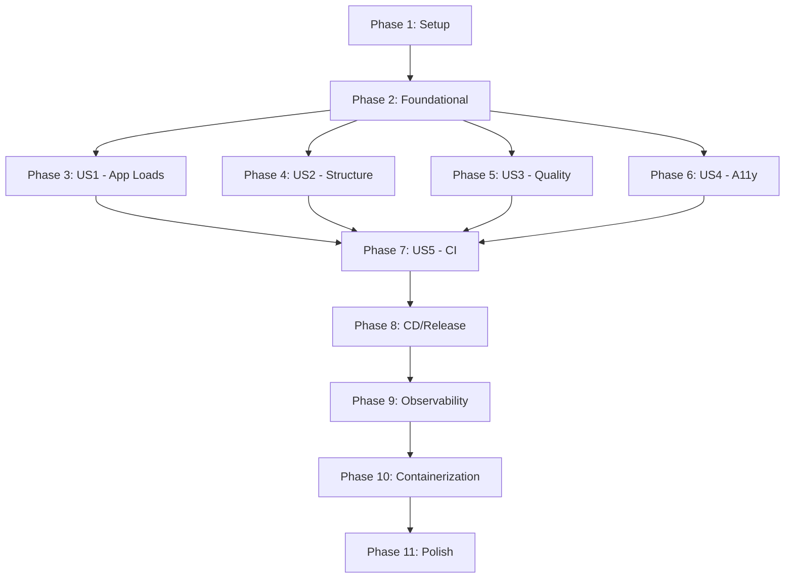

# Tasks: Frontend Scaffolding

**Input**: Design documents from `/specs/002-frontend-scaffolding/`
**Prerequisites**: plan.md ✓, spec.md ✓, research.md ✓, data-model.md ✓, quickstart.md ✓

## Format: `[ID] [P?] [Story] Description`

- **[P]**: Can run in parallel (different files, no dependencies)
- **[Story]**: Which user story this task belongs to (e.g., US1, US2, US3)
- Include exact file paths in descriptions

## Path Conventions

- **Web app**: `frontend/` directory at repository root (alongside existing `backend/`)

---

## Phase 1: Setup (Shared Infrastructure)

**Purpose**: Project initialization with Node.js 24.x via Volta, Next.js 16.1.x, and base dependencies

- [x] T001 Initialize Next.js 16.x project in `frontend/` with TypeScript and App Router
- [x] T002 Configure Volta pinning in `frontend/package.json` (Node.js 24.x, npm 10.x)
- [x] T003 [P] Install and configure TailwindCSS 4.x in `frontend/tailwind.config.ts`
- [x] T004 [P] Initialize shadcn/ui with `frontend/components.json` configuration
- [x] T005 [P] Create `frontend/src/lib/utils.ts` with cn() helper for class merging

---

## Phase 2: Foundational (Blocking Prerequisites)

**Purpose**: Core configuration that MUST be complete before ANY user story can be implemented

**⚠️ CRITICAL**: No user story work can begin until this phase is complete

- [x] T006 Configure TypeScript in `frontend/tsconfig.json` with strict mode and path aliases
- [x] T007 [P] Configure ESLint 9.x flat config in `frontend/eslint.config.mjs` with:
  - TypeScript rules
  - Next.js rules
  - Import order validation
  - JSON output format for SonarQube
- [x] T008 [P] Configure Prettier in `frontend/prettier.config.mjs` with TailwindCSS plugin
- [x] T009 [P] Configure Jest in `frontend/jest.config.ts` with TypeScript and React Testing Library
- [x] T010 [P] Configure Playwright in `frontend/playwright.config.ts` for E2E testing
- [x] T011 Configure Next.js in `frontend/next.config.ts` with:
  - Experimental instrumentation hook enabled
  - Production source maps for debugging
- [x] T012 Add npm scripts to `frontend/package.json`:
  - `dev`, `build`, `start`
  - `lint`, `lint:fix`
  - `format`, `format:check`
  - `test`, `test:e2e`, `test:a11y`

**Checkpoint**: Foundation ready - user story implementation can now begin

---

## Phase 3: User Story 1 - Verify Frontend Application Loads (Priority: P1) 🎯 MVP

**Goal**: Deliver a working Next.js application with SSR that loads successfully in the browser

**Independent Test**: Navigate to `http://localhost:3000` and verify server-rendered HTML content is visible immediately

### Implementation for User Story 1

- [x] T013 [US1] Create root layout in `frontend/src/app/layout.tsx` with:
  - HTML lang attribute for accessibility
  - Meta viewport configuration
  - Font loading (system fonts or Next.js font optimization)
- [x] T014 [US1] Create global styles in `frontend/src/app/globals.css` with TailwindCSS imports
- [x] T015 [US1] Create home page in `frontend/src/app/page.tsx` with:
  - Server-rendered welcome content
  - Semantic HTML structure (main, header elements)
  - Page title and meta description (FR-015)
- [x] T016 [US1] Verify SSR by checking page source contains main content (FR-002, FR-003)

**Checkpoint**: Application loads with server-rendered content - MVP functional

---

## Phase 4: User Story 2 - Project Structure Compliance (Priority: P2)

**Goal**: Establish clear directory organization with architectural validation

**Independent Test**: Run ESLint import validation and verify no architectural violations

### Implementation for User Story 2

- [x] T017 [P] [US2] Create `frontend/src/components/ui/` directory for shadcn/ui components
- [x] T018 [P] [US2] Create `frontend/src/components/layout/` directory for layout components
- [x] T019 [P] [US2] Create `frontend/src/services/` directory for API clients
- [x] T020 [P] [US2] Create `frontend/public/` directory for static assets
- [x] T021 [P] [US2] Create `frontend/tests/unit/` directory for Jest tests
- [x] T022 [P] [US2] Create `frontend/tests/e2e/` directory for Playwright tests
- [x] T023 [US2] Configure eslint-plugin-import rules in `frontend/eslint.config.mjs` for:
  - Layer dependency validation (FR-005)
  - Import order enforcement
  - No circular dependencies
- [x] T024 [US2] Create Header component in `frontend/src/components/layout/Header.tsx`
- [x] T025 [US2] Create Footer component in `frontend/src/components/layout/Footer.tsx`
- [x] T026 [US2] Create Shell component in `frontend/src/components/layout/Shell.tsx` that composes Header + Footer
- [x] T027 [US2] Integrate Shell component into root layout `frontend/src/app/layout.tsx`

**Checkpoint**: Project structure follows established conventions with architectural validation

---

## Phase 5: User Story 3 - Quality Tooling Integration (Priority: P3)

**Goal**: Integrate linting, formatting, and static analysis with JSON output for SonarQube

**Independent Test**: Run `npm run lint` and `npm run format:check` - both should pass

### Implementation for User Story 3

- [x] T028 [US3] Create sample unit test in `frontend/tests/unit/utils.test.ts` to verify Jest setup
- [x] T029 [US3] Verify ESLint JSON output works: `npm run lint -- -f json -o eslint-results.json`
- [x] T030 [US3] Add pre-commit quality check script or document manual verification steps
- [x] T031 [US3] Create `.gitignore` entries in `frontend/.gitignore` for:
  - `node_modules/`
  - `.next/`
  - `eslint-results.json`
  - Coverage reports

**Checkpoint**: Quality tooling produces reports compatible with SonarQube

---

## Phase 6: User Story 4 - Accessibility Foundation (Priority: P4)

**Goal**: Establish WCAG 2.1 AA compliance foundation with automated testing

**Independent Test**: Run Lighthouse accessibility audit and verify score ≥90

### Implementation for User Story 4

- [x] T032 [US4] Add skip-to-content link in `frontend/src/app/layout.tsx` for keyboard navigation (FR-013)
- [x] T033 [US4] Ensure all layout components use semantic HTML (header, main, footer, nav) (FR-014)
- [x] T034 [US4] Configure axe-core integration in `frontend/tests/e2e/` for accessibility testing
- [x] T035 [US4] Create accessibility E2E test in `frontend/tests/e2e/accessibility.spec.ts` that:
  - Runs axe-core against home page
  - Fails on critical/serious violations (SC-005)
- [x] T036 [US4] Verify keyboard navigation works for all interactive elements
- [x] T037 [US4] Add ARIA labels where needed for screen reader support

**Checkpoint**: Accessibility foundation established with automated validation

---

## Phase 7: User Story 5 - CI Pipeline Foundation (Priority: P5)

**Goal**: Configure GitHub Actions CI pipeline for automated PR validation

**Independent Test**: Create PR and verify CI pipeline runs build, lint, and test steps

### Implementation for User Story 5

- [x] T038 [US5] Create GitHub Actions workflow in `.github/workflows/frontend-ci.yml` with:
  - Trigger on PR to trunk (frontend changes)
  - Node.js 24 setup
  - npm ci for dependency installation
  - Build step (FR-009)
  - Lint step with failure on violations (FR-010)
  - Format check with failure on violations (FR-011)
  - Unit test step
- [x] T039 [US5] Add Dockerfile linting step with Hadolint (if Dockerfile exists)
- [x] T040 [US5] Add Dockerfile security scanning step with Checkov (if Dockerfile exists)
- [x] T041 [US5] Configure SonarQube Cloud integration for ESLint JSON reports (FR-008)

**Checkpoint**: CI pipeline validates all quality checks on PR

---

## Phase 8: CD and Release Pipelines (Constitution Requirement)

**Purpose**: Complete DevOps pipeline architecture per constitution (CI/CD/Release)

- [x] T042 [US5] Create GitHub Actions CD workflow in `.github/workflows/frontend-cd.yml` with:
  - Trigger on push to trunk branch (frontend changes)
  - Node.js 24 setup
  - Full build and test suite
  - Snyk vulnerability scanning (constitution requirement)
  - Deploy to development environment
- [x] T043 [US5] Create GitHub Actions Release workflow in `.github/workflows/frontend-release.yml` with:
  - Trigger on GitHub release creation
  - Full build, test, and security validation
  - Performance testing with Gatling (if applicable)
  - Deploy to production environment
  - Rollback capability verification

**Checkpoint**: All three pipelines (CI/CD/Release) operational per constitution

---

## Phase 9: Observability (Cross-Cutting)

**Purpose**: Integrate OpenTelemetry and Core Web Vitals reporting

- [x] T044 [P] Install @vercel/otel package in `frontend/package.json`
- [x] T045 Create instrumentation file `frontend/src/instrumentation.ts` for OpenTelemetry setup (FR-017)
- [x] T046 Create web vitals reporter using `useReportWebVitals` hook in `frontend/src/app/layout.tsx` (FR-016)
- [x] T047 Configure environment variables in `frontend/.env.example`:
  - `OTEL_EXPORTER_OTLP_ENDPOINT`
  - `OTEL_SERVICE_NAME`
  - `NEXT_PUBLIC_APP_URL`
- [x] T048 Verify no console.log statements in production build (FR-018)

---

## Phase 10: Containerization

**Purpose**: Create production-ready Dockerfile with security best practices

- [x] T049 Create `frontend/Dockerfile` with:
  - Node.js 24 Alpine base image
  - Multi-stage build (deps, builder, runner)
  - Non-root user for security
  - HEALTHCHECK instruction
  - OpenTelemetry agent configuration
- [x] T050 Verify Hadolint passes: `hadolint frontend/Dockerfile`
- [x] T051 Verify Checkov passes: `checkov -f frontend/Dockerfile`
- [x] T052 Add `.dockerignore` in `frontend/.dockerignore` for optimized builds

---

## Phase 11: Polish & Cross-Cutting Concerns

**Purpose**: Final validation and cleanup

- [x] T053 [P] Run full lint check and fix any issues
- [x] T054 [P] Run full format check and fix any issues
- [x] T055 Run all unit tests and verify passing
- [x] T056 Run E2E tests including accessibility
- [x] T057 Verify Lighthouse accessibility score ≥90 (SC-007)
- [x] T058 Verify initial page load <3s (SC-001)
- [x] T059 Test in Chrome, Firefox, Safari, Edge (latest 2 versions) (SC-006)
- [x] T060 Validate quickstart.md instructions work end-to-end
- [x] T061 Update `CLAUDE.md` with frontend commands and structure

---

## Dependencies & Execution Order

### Phase Dependencies

### User Story Dependencies

- **User Story 1 (P1)**: Can start after Foundational - No dependencies on other stories
- **User Story 2 (P2)**: Can start after Foundational - No dependencies on other stories
- **User Story 3 (P3)**: Can start after Foundational - No dependencies on other stories
- **User Story 4 (P4)**: Can start after Foundational - Benefits from US2 structure
- **User Story 5 (P5)**: Depends on US1-US4 having basic implementations to validate

### Parallel Opportunities

- Phase 1: T003, T004, T005 can run in parallel
- Phase 2: T007, T008, T009, T010 can run in parallel
- Phase 4: T017-T022 can run in parallel (directory creation)
- Phase 9: T044 can run in parallel with other setup
- Phase 11: T053, T054 can run in parallel

---

## Implementation Strategy

### MVP First (User Story 1 Only)

1. Complete Phase 1: Setup (T001-T005)
2. Complete Phase 2: Foundational (T006-T012)
3. Complete Phase 3: User Story 1 (T013-T016)
4. **STOP and VALIDATE**: Application loads with SSR content
5. Deploy/demo if ready

### Incremental Delivery

1. Setup + Foundational → Foundation ready
2. Add User Story 1 → SSR app loads → MVP!
3. Add User Story 2 → Project structure validated
4. Add User Story 3 → Quality tooling working
5. Add User Story 4 → Accessibility foundation
6. Add User Story 5 → CI pipeline operational
7. Add CD/Release pipelines → Full DevOps pipeline
8. Add Observability + Containerization → Production ready
9. Polish → Ready for PR

---

## Notes

- [P] tasks = different files, no dependencies
- [Story] label maps task to specific user story for traceability
- Each user story should be independently completable and testable
- Commit after each task or logical group
- Stop at any checkpoint to validate story independently
- Test SSR by viewing page source - content should be in initial HTML
